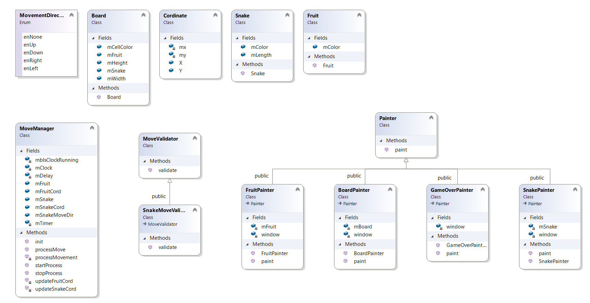

## Snake-game-using-SFML

# Intention
There are many GUI framework ie. Qt. But I wanted to learn a new framework and I came across SFML. and I found it very intresting.
I decied to create a small classic game, Snake game. 
I tried to keep classic as atomic as possible and tried to deligate responsibility as un-coupled as possible follwing software design principles.

# About SFML
Simple and Fast Multimedia Library (SFML) SFML provides a simple interface to the various components of your PC, to ease the development of games and multimedia applications. It is composed of five modules: system, window, graphics, audio and network.
To read more about SFML use https://www.sfml-dev.org/ url. 

# About classes
Responsiblity of each class is very distinctly define to avoid any coupling.
Below are the description of the class in the project: 
Cordinate class : holds the X and Y cordinate value.  
Board class : holds the attributes of a board. (and do not paint anything on itself by itself) 
Snake class : hold the length and color of the snake. (also do not paint anything on itself by itself) 
Fruit class : As name suggests it hold the attribute of a fruit ie color in this context.(type of fruit do not matter) 
IMoveGenerator : This is a inteface. This class genrates new/next moves for diffrent entities on the board, in our case snake and fruit. 
SnakeMoveGenerator : This is concrete class of IMoveGenerator. it takes current cordinate and direction of snake to return its new/next cordinates. 
FruitMoveGenerator : This is concrete class of IMoveGenerator. it takes current cordinate of fruit to return its new/next cordinates. 
ICordinateValidator : This is a interface. 
SnakeCordinateValidator : its concrete class of ICordinateValidator, which check if given cordinate is valid or not to procced the game (checks if snakes has touch itself).  
IPainter : This is a inteface. 
SnakePainter : This is concrete class of IMoveGenerator. And this class is responsible to paint the snake onto the RenderWindow. 
FruitPainter : This is concrete class of IMoveGenerator. And this class is responsible to paint the fruit onto the RenderWindow. 
GameOverPainter : This is another concrete class of IMoveGenerator. And this class is responsible to paint the game over text onto the RenderWindow.  
GameManager : This class is moderator of the game and is responsible to start the game. This class is also responsible for validating if new move of the snake is valid to continoue the game or if next/new fruit needs to updated. 

Below is the overview of the class diagram (please note that relationship between classes are not defined completely in the below diagram) 

